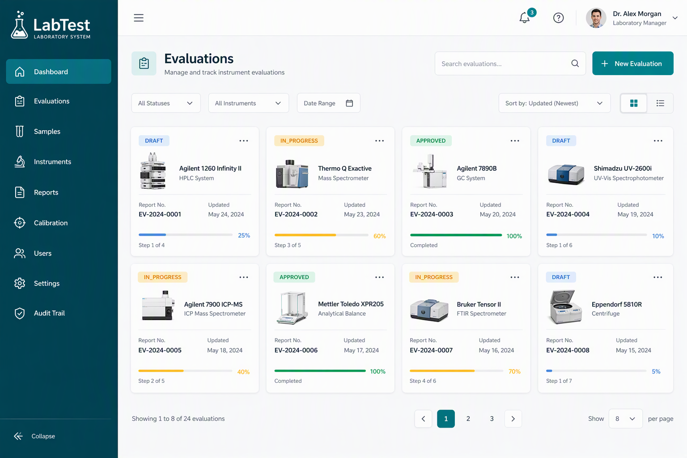
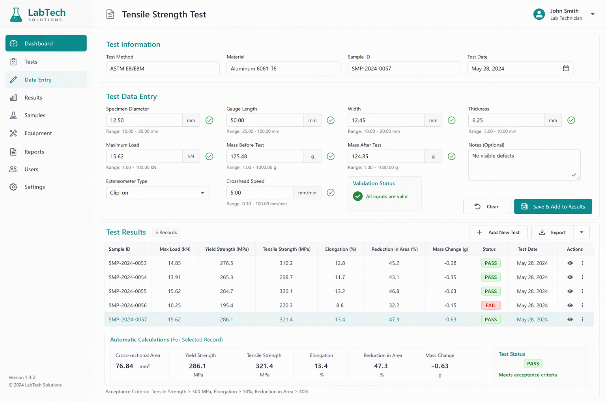
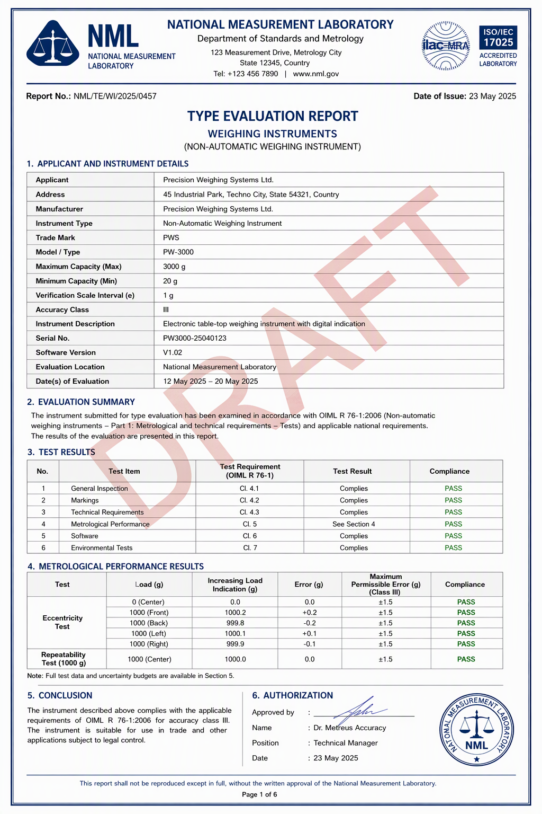

# NAWI Type Evaluation Report System

<p align="center">
  <strong>A web-based system for managing type evaluation reports for Non-Automatic Weighing Instruments (NAWIs) compliant with OIML R 76 standards.</strong>
</p>

<p align="center">
  
</p>

---

## What is this project?

This is a **laboratory management system** built for legal metrology labs that test and certify weighing instruments (like scales and balances) used in trade and commerce.

**In simple words:**
- Lab engineers use this system to record test observations for weighing instruments
- The system automatically calculates errors and determines if instruments PASS or FAIL based on international standards (OIML R 76)
- It generates official type evaluation reports in PDF and Word formats
- All data is stored digitally for easy retrieval and audit trails

**Why it matters:**
Weighing instruments used in shops, industries, and laboratories must be accurate to ensure fair trade. This system helps government labs efficiently test and certify these instruments according to international standards.

---

## Features

### Core Functionality

- **Evaluation Management** - Create and track instrument evaluations from start to finish
- **Automated Calculations** - Automatic error calculation and MPE (Maximum Permissible Error) lookup based on OIML R 76
- **Real-time Validation** - Instant feedback on data entry with validation checks
- **Pass/Fail Determination** - Automatic verdict calculation for each test and overall instrument
- **Multi-format Export** - Generate reports in PDF and DOCX formats
- **Digital Repository** - Search and retrieve past evaluations and reports

### Testing & Compliance

- **Complete Test Coverage** - Supports all OIML R 76 tests:
  - Weighing performance
  - Eccentricity tests
  - Repeatability tests
  - Zero return tests
  - Creep tests
  - Warm-up tests
  - Disturbance tests (voltage, dips, burst, surge, ESD, radiated, conducted)
  - Damp heat and span stability
  - Construction checks

### User Management

- **Role-Based Access Control (RBAC)**
  - **ADMIN** - Full system access
  - **ENGINEER** - Create and manage evaluations
  - **REVIEWER** - Review and approve evaluations
  - **VIEWER** - Read-only access to approved reports

- **Audit Trail** - Complete logging of all actions for compliance

### Report Features

- **Standardized Format** - Reports follow exact OIML R 76-2 layout
- **Version Control** - Track changes and maintain report versions
- **Digital Signatures** - Optional PDF signing with digital certificates
- **QR Codes** - Verification codes on reports for authenticity
- **SHA-256 Hashing** - Ensure report integrity

---

## Technology Stack

| Component | Technology |
|-----------|-----------|
| **Backend** | Python 3.14 + FastAPI |
| **Frontend** | React 19 + TypeScript + Vite |
| **Database** | PostgreSQL 16 (SQLite for development) |
| **Styling** | Tailwind CSS |
| **Authentication** | JWT tokens with refresh rotation |
| **Password Security** | Argon2 hashing |
| **PDF Generation** | WeasyPrint |
| **Word Export** | python-docx |
| **Digital Signatures** | pyHanko |
| **ORM** | SQLAlchemy 2.0 + Alembic |

---

## Screenshots

### Dashboard
<p align="center">
  
</p>
*Overview of all evaluations with status tracking*

### Test Data Entry
<p align="center">
  
</p>
*Real-time data entry with automatic calculations and validation*

### Report Generation
<p align="center">
  
</p>
*Professional PDF reports following OIML R 76-2 format*

---

## Getting Started

### Prerequisites

- **Python 3.12 or higher**
- **Node.js 20 or higher**
- **PostgreSQL 16** (optional, SQLite works for development)
- **Git**

### Installation

#### 1. Clone the Repository

```bash
git clone https://github.com/Pawan-webdeveloper/Report-OIML.git
cd Report-OIML
```

#### 2. Backend Setup

```bash
# Navigate to backend directory
cd backend

# Create virtual environment
python3 -m venv .venv

# Activate virtual environment
# On macOS/Linux:
source .venv/bin/activate
# On Windows:
# .venv\Scripts\activate

# Install dependencies
pip install -r requirements.txt

# Install WeasyPrint dependencies (macOS only)
brew install pango libffi

# Set up environment variables
cp .env.example .env
# Edit .env with your database credentials if using PostgreSQL

# Initialize database (SQLite by default)
alembic upgrade head

# Load seed data (optional)
python -m app.scripts.seed_data
```

#### 3. Frontend Setup

```bash
# Open a new terminal and navigate to frontend directory
cd frontend

# Install dependencies
npm install

# Start development server
npm run dev
```

#### 4. Start the Application

**Backend:**
```bash
cd backend
# Use the startup script (sets proper environment for WeasyPrint on macOS)
./start.sh

# Or manually:
source .venv/bin/activate
export DYLD_FALLBACK_LIBRARY_PATH="/opt/homebrew/lib:${DYLD_FALLBACK_LIBRARY_PATH}"  # macOS only
uvicorn app.main:app --reload --host 127.0.0.1 --port 8000
```

**Frontend:**
```bash
cd frontend
npm run dev
```

The application will be available at:
- **Frontend**: http://127.0.0.1:5173
- **Backend API**: http://127.0.0.1:8000
- **API Documentation**: http://127.0.0.1:8000/docs

### Default Login Credentials

```
Username: admin
Password: admin123
```

**Important:** Change the default password after first login!

---

## Usage Guide

### Creating a New Evaluation

1. **Log in** to the system with your credentials
2. Navigate to **Evaluations** from the dashboard
3. Click **"New Evaluation"**
4. Fill in instrument details:
   - Manufacturer information
   - Instrument model and serial number
   - Accuracy class and capacity
   - Application details
5. Set evaluation conditions (temperature, humidity, etc.)
6. Save the evaluation

### Recording Test Results

1. Open an evaluation from the list
2. Click on a test type (e.g., "Weighing", "Eccentricity")
3. Enter test observations:
   - Load values
   - Indication values
   - Environmental conditions
4. The system automatically:
   - Calculates errors
   - Determines pass/fail status
   - Validates data
5. Repeat for all required tests

### Generating Reports

1. Navigate to a completed evaluation
2. Click **"Export"** button
3. Choose format:
   - **PDF** - Official report with digital signature option
   - **DOCX** - Editable Word document
4. Download or view the report
5. Reports are automatically versioned and stored

### Review and Approval Workflow

1. **Engineer** completes evaluation and submits for review
2. **Reviewer** examines the evaluation:
   - Checks test data
   - Verifies calculations
   - Reviews warnings
3. **Reviewer** approves or returns with comments
4. Once approved, report can be exported and issued

---

## Project Structure

```
Report-OIML/
├── backend/
│   ├── app/
│   │   ├── api/              # API endpoints
│   │   ├── core/             # Configuration, security, database
│   │   ├── models/           # SQLAlchemy models
│   │   ├── reporting/        # PDF/DOCX generation
│   │   ├── routers/          # FastAPI routers
│   │   ├── rulesets/         # OIML R 76 rules
│   │   ├── schemas/          # Pydantic schemas
│   │   └── services/         # Business logic
│   ├── alembic/              # Database migrations
│   ├── requirements.txt
│   └── start.sh              # Startup script
│
├── frontend/
│   ├── src/
│   │   ├── api/              # API client
│   │   ├── components/       # React components
│   │   ├── pages/            # Page components
│   │   ├── store/            # Zustand state management
│   │   └── lib/              # Utilities
│   ├── package.json
│   └── vite.config.ts
│
└── docs/                     # Documentation
```

---

## Development

### Running Tests

**Backend:**
```bash
cd backend
pytest
```

**Frontend:**
```bash
cd frontend
npm test
```

### Database Migrations

```bash
cd backend
# Create new migration
alembic revision --autogenerate -m "Description"

# Apply migrations
alembic upgrade head

# Rollback one step
alembic downgrade -1
```

---

## Deployment

### Docker (Recommended)

```bash
# Build and run with Docker Compose
docker-compose up -d
```

### Manual Deployment

1. **Backend:**
   - Use gunicorn with uvicorn workers
   - Set up reverse proxy (nginx/Caddy)
   - Configure PostgreSQL database
   - Set proper environment variables

2. **Frontend:**
   - Build production bundle: `npm run build`
   - Serve static files with nginx or CDN

See `docs/deployment.md` for detailed deployment instructions.

---

## Compliance & Standards

This system implements:

- **OIML R 76-1:2006** - Non-automatic weighing instruments - Technical requirements
- **OIML R 76-2:2007** - Non-automatic weighing instruments - Test procedures
- **Legal Metrology Act, 2009** (India)
- **Legal Metrology (General) Rules, 2011** (India)

---

## Contributing

Contributions are welcome! Please:

1. Fork the repository
2. Create a feature branch (`git checkout -b feature/amazing-feature`)
3. Commit your changes (`git commit -m 'Add amazing feature'`)
4. Push to the branch (`git push origin feature/amazing-feature`)
5. Open a Pull Request

---

## License

This project is developed for the Department of Consumer Affairs, Government of India under the Smart India Hackathon 2026.

---

## Support & Contact

For questions, issues, or contributions:

- **GitHub Issues**: [Report a bug](https://github.com/Pawan-webdeveloper/Report-OIML/issues)
- **Email**: pawan572893@gmail.com

---

## Acknowledgments

- **Department of Consumer Affairs**, Government of India - Problem statement
- **OIML** (International Organization of Legal Metrology) - Standards and specifications
- **Smart India Hackathon 2026** - Platform for development

---

<p align="center">
  <strong>Built with precision for legal metrology compliance</strong>
</p>
